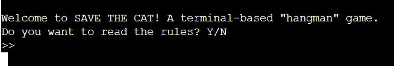

# S_ve the c_t  

S_VE THE C_T is a terminal-based "hangman" game variation, with a dark(er) twist. 

To save the cat, the user has to guess a word/sentence, one letter at a time. Each mistake comes at a price...

**[View the live app here](https://save-the-cat-04e7dc8a4683.herokuapp.com)**

---
## Table of Contents
- [User Experience](#user-experience)
	- [Target audience](#target-audience)
	- [User Stories](#user-stories)
	- [App Aims](#app-aims)
- [Design](#design)
    - [Flowchart](#flowchart)
	- [Imagery Used](#imagery-used)
- [Features](#features)
	- [Future Features](#future-features)
- [Technologies Used](#technologies-used)
- [Testing](#testing)
	- [Code Validation](#code-validation)
	- [Manual Testing](#manual-testing)
- [Bugs](#bugs)
- [Deployment steps](#deployment-steps)
	- [GitHub](#github)
	- [Cloning and forking](#cloning-and-forking)
-  [References & Acknowledgements](#references-and-acknowledgements)
	- [Sources](#sources)
- [Credits](#credits)
- [Acknowledgements](#acknowledgements) 
---
## User Experience
Now, let's have a look at our target users and their needs!

### Target Audience
This game, in its current state, has a broad audience that it can appeal to. In order to play, you would need to know the letters of the alphabet, how to read/spell in English and use a computer.

Hangman is a game that most of us have played as a child. It is worth noting, however, that due to its gore/graphic theme, it may not be suited for young children. S_ve the c_t is no different and therefore, might be more suited for ages 7+.

### User Stories

**First-time user**
* I need an easy-to-understand introduction to the game and its rules
* I want to be able to choose the level of difficulty of the game
* I need to be aware of my life count
* I need to see a list of the guesses I have already made so I do not repeat them
* I need to receive clear feedback if I enter a wrong type of data and have a chance to try again without having to restart the game
* I need a clear indication if my guess was right or wrong
* I need to know when the game is started/over
* I want to be shown the correct answers if I game over
* I need to have the option to play again after a game if I want to

**Returning user**
*  I want to be able to skip the rules in the intro because I already know them
* I do not want to get the same mystery word or sentence to guess

### App Aims
The main goals of this app were as follows:

* to entertain the user;
* to challenge the user's vocabulary and patter recognition skills;
* to have straightforward, enjoyable interface and mechanics

---
##   Design
As this project focused on applying my newly acquired Python knowledge to make a terminal-based app, there wasn't as much of a design process as with previous projects. It also meant that whatever design I wanted to create, it would need to fit within the 80-character wide terminal screen!

The biggest part of the design was coming up with the functions, classes, variables, etc. needed for the program.

I knew that I wanted something different than the typical hangman as the main theme of this app, though. 

### Flowchart
While hangman is a pretty simple game at its core, it was harder than planned for me to come up with a flowchart that represented its mechanics accurately.

Typically, we play this game with pen and paper, and greatly underestimate the numerous small steps that our brains take 

Flowchart image

### Imagery used 
Beyond the awful connotations/history behind it, I wanted to have something a bit more creative than a stick man on an already bare terminal.

A drowning cat is not necessarily the merriest of concepts, either. But the one that I had in mind (and designed) was perfect to show a gradual, but dramatic, illustration of the dire situation the user is faced with:

You can find the rest of the ASCII visuals used on this project in its `visuals.py` file:

* the `drowning_cat` dictionnary holds the variations of the cat slowly sinking in ('lives': 'art') pairs;
* then we have the logo and victory visuals which use cats as a banner and text in a representation of keyboard keys;
* then we have the game over banner with the same text style but with a banner made using waves (to symbolize the drowning);
* victory and game over also come with a cat illustration:
	* wet cat laying on the ground after being saved
	wet cat turned into an angelic ghost as he ascends to heaven.

----
## Features  
Hangman is a game in which players try to guess what letters are in a word before a complete picture of a man getting hanged appears. With each wrong guess, one element of the man (and the gruesome contraption that hangs him) is added.

S_ve the c_t keeps this mechanic, but as noted before, our cat is slowly drowning in waves (~) of water instead.

Let's have a look at the main features of this app:

**User input**

User input is collected in four different places:

* At the start of the program (in the `roll_intro` function), to see if they want to skip or read the rules;

* During the `game_choice` function's execution, where they need to pick a game mode and game difficulty;

* During the `get_user_guess` function's execution, where the player is prompted to enter their guess;
* At the end of the game (victory/game over), where the player is asked if they want to play again:
	* yes - calls a function that resets all game settings and player status, and brings the player back to the intro;
	* no - brings the game to an end.

**Hangman mechanics**

We have two separate functions that each handle the random generation of a word or sentence based on the game mode and difficulty that the player chose.

* They use the methods from the imported classes of the `Wonderwords` module.
* Longer/more complex words/sentences are generated based on the difficulty level chosen:

* Using a dictionary from `visuals.py`, we update the image of the cat based on the player's remaining lives:
	* 9 lives (full health):
	
	* Almost drowning:
	
* The `get_user_guess` function:
	* calls the correct hangman function based on the player's game settings;
	* prompts the user for the letter they would like to guess;
	* displays the current state of the mystery word/sentence by replacing each letter with an underscore;
	* it takes care of revealing the mystery letters when the player's guess is correct

**Error handling**

Because this game relies on user input, it is crucial to have good validation and error handling in place. The user needs to receive feedback if they enter a wrong character or lose a life, for example.

The `input_validation` function handles three types of inputs/possible errors. Using `if statements`, it checks the position of the player on our progress bar to decide which validation rule to execute:

* for the stages where a yes/no answer is required from the user:
	* we created the global lists `answer_yes` and `answer_no` which contain variations of Y/N that a user could enter in the terminal
	
* for the stages where a numerical value is required from the user, we have two separate `elif`s: 
	* one for questions that only accept 1/2, and another for those that take 1/2/3:
	

And then, when it comes to the guessing stage, our input validation is built-in the `get_user_guess` function:

* it compares the user input with the alphabet to see if it's a correct input;

* it checks if the input letter is already present in the player's guesses;
* it also checks if the input letter is present in the mystery word/sentence;
* and uses the Player class' method to remove a life if the input is an incorrect answer

****

### Future Features
Here are a few of the ideas that I thought of while working on this project and may implement in the future, as I deepen my understanding of Python and broaden my programming skills.

**Quiz**

In order to make the game a bit more rewarding and educational, it would be interesting to have a higher difficulty level where we add a vocabulary check _after_ the user has guessed all the letters.

In this mode, victory can only be achieved by choosing the correct definition/synonym of the word.

Taking it up another notch, we could also have a level with a second language. Instead of simply being quizzed on the meaning of a word/sentence, we could be asked to translate it!

**Style the terminal**

In order to increase the replayability of the game and the user experience, I would like to implement a typing effect that would slow down the rate at which data is printed.

I looked into the possibility to trigger a screen clear using the OS module. Clearing the terminal after each stage of the game seems unpractical and also removes the option for the user to go over what was shared before.

Snce this did not satisfy my vision for the game, I want to look into other options to style the terminal and make it feel more like a conversation _with_ the user.

---
## Technologies used
This project was created using the [Python language](https://docs.python.org/3/).

---
## Testing  

### Code Validation
As this is a Python-centric project, the [PEP8 validator](https://pep8ci.herokuapp.com) was used to test the program (`run.py`):

* Once I corrected the extra whitespaces and missing lines, no errors were found:

### Manual testing
The code that I wrote for this project was planned in advance, and tested throughout the whole creation process.

* I used [Google Sheets](https://docs.google.com/spreadsheets/) to plan out my game flow, program functions and other crucial elements;
* Before I created the repository, I had ran my main functions through the [Python tutor tool](https://pythontutor.com) to check their logic;
* While building the project via [Gitpod](https://gitpod.io/), I made use of the terminal and virtual environment to test my code as it slowly took shape;
* Once I had enough "bones" to work with, I proceeded with an early deployment to Heroku to make sure that I was seeing the correct output of my work;

Until the end of the development, I continued with these methods of testing my work. I periodically ran my `run.py` file in the PEP8 validator and cleared my code of trailing spaces, missing lines, etc.

Maintaining these routine checks allowed me to spot errors in my code (notably, indentations and misplaced keywords) before they became real issues.

---
## Bugs 
Bugs are an inherent part of the creative process that is programming. In Python, indentation plays a crucial role in determining scope and having an extra space in the wrong place can easily wreck the app flow.

One issue that surfaced while working on this project was related to the `get_user_guess` function. This function contains a loop that handles prompting the user for a guess while the user still has lives left.

The last component of this function is an _if statement_ that handles the victory/game over mechanics:

`if len(letters) == 0:
        print(victory)
        player.progress = progress_bar[5]
        print(f"Congratulations!\nYou found all the letters:\n{mystery}")
else:
    print(game_over)
    player.progress = progress_bar[6]
    print(f"Game Over...\nYou were so close :(")
    print(f"Your mystery was: {mystery}")`

A wrong indent was causing the game_over visuals to be printed to the terminal after every single wrong guess from the user. To fix it, I simply needed to remove this indent, so the statement would no longer be part of the loop.

----
## Deployment Steps
Github Pages was used to deploy this live website. 

### Heroku
The steps taken were as follows:

1. From your Heroku Dashboard, create an app
2. Once created, add two buildpacks from the _Settings_ tab. The ordering is as follows:
    1. `heroku/python`
    2. `heroku/nodejs`
3. Create a _Config Var_ called `PORT`. Set this to `8000`
4. From the _Deploy_ tab, you can then connect your GitHub account in the _Deployment method_ section.
5. Below that you will then be able to search for your repository and deploy your app.

### Cloning and forking
To view the cloning options available on Github:

1. Log in (or sign up) to [Github](https://github.com).
2. Find the repository for this project from [my profile](https://github.com/chl03rivs) in [s_ve-the-c_t](https://github.com/chl03rivs/s_ve-the-c_t).
3. Click on the blue **<> Code** button with the downward arrow.

If you wish to download a copy of this program and run it on your machine, you can do so  by choosing the **Download ZIP** options. Follow the usual steps of your machine to unzip the file and run it in your preferred software.

Note: your machine will need to have XX installed in order to run this project.

As this is a student project for the Code Institute Diploma in Full-Stack Development, forking is reserved to the assessment team. [GitHub documentation is available with the steps](https://docs.github.com/en/pull-requests/collaborating-with-pull-requests/working-with-forks/fork-a-repo).

----
## References & acknowledgments

Creativity and originality do not mean standing alone and figuring it all out on your own. Creative power is fuelled by community. So I am going to share the sources that helped me build the required knowledge for this project.

### Sources

**Documents consulted**

- [Wonderwords package/documentation](https://pypi.org/project/wonderwords/) -allowed me to quickly set up the random word and sentence generators
- [This article from PythonPool](https://www.pythonpool.com/python-alphabet/) - helped me understand how to initialize a list with the alphabet

**Tutorials referenced**

- [Tutorial by Kylie Ying](https://youtu.be/cJJTnI22IF8?si=LJNLZAjF0wJXX5WI) - helped inspire the structure of my first Python program!

**Other**

- [The ASCII Art website](https://www.asciiart.eu/) - helped me generate ASCII banners from text quickly!

## Credits  
Credit where credit is due

- The artists whose art I borrowed from [the ASCII Art website](https://www.asciiart.eu/animals/cats) for the cat illustrations:
	* Game over cat from Felix Lee (tweaked by me)
	* Victory cat from _Unknown_ :(

## Acknowledgements

As always, I want to thank Code Institute for the great learning materials they provided on Python, and my precious partner, Billy, for his undying love & support ♥
